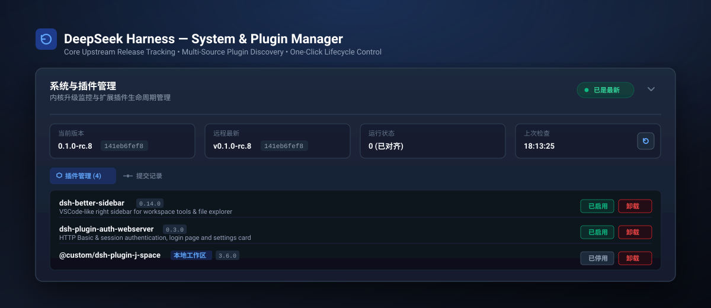

<div align="center">

# DeepSeek Harness — System &amp; Plugin Manager

[](LICENSE)
[](https://github.com/deepseek-ai/deepseek-harness)
[](package.json)
[](#)

English | [简体中文](README_CN.md)

<br />



<br />

**A native, production-grade System &amp; Plugin Management Center for [DeepSeek Harness (dsh)](https://github.com/deepseek-ai/deepseek-harness).**  
Provides real-time core version tracking against upstream GitHub releases, automated 3rd-party plugin discovery, safe enable/disable toggling, and one-click uninstall lifecycle management directly within the Web UI Settings panel.

</div>

---

## 🌟 Highlights &amp; Key Features

- 🔄 **Core Git Upstream Tracking**:
  - Compares your local git commit against upstream `origin/master` (or GitHub releases).
  - Displays current version, upstream commit SHA, commit date, and behind count in real-time.
  - Interactive top-right SVG refresh button for instant status polling.

- 🧩 **Comprehensive Multi-Source Plugin Discovery**:
  - Automatically scans active profile bundles (`dsh.profile.bundles` in `package.json`), runtime overlays (`cordis.patch.yml`), `~/.dsh/plugins/`, and standalone user workspaces (`~/dsh-*`).
  - Hides internal `@deepseek-ai/*` and `@cordisjs/*` packages to keep your management surface focused on custom community plugins.

- ⚡ **One-Click Lifecycle Control**:
  - **Enable / Disable Toggle**: Mount or unmount any plugin dynamically.
  - **Safe Uninstall**: Removes plugin references from `package.json`, cleans patch files, unlinks plugins, and cleans dependencies via package manager.
  - **Service Hot-Restart**: Smoothly restart the DSH Web daemon in the background to apply configuration changes.

- 🎨 **100% Official DSH Design Specification**:
  - Seamlessly integrates into `Settings > Plugin Configuration` (`settings.plugin.item` slot).
  - Adheres strictly to DSH spacing, typography, border-radius (`12px`), dark theme variables, and pill badges.
  - Fully bilingual with zero-latency switching between **English** and **简体中文**.

---

## 📦 Installation

### Option 1: Via DSH CLI

```bash
dsh plugin add github:kolawong/dsh-plugin-update-checker
```

### Option 2: Local Package Link

Clone this repository to your machine or server:

```bash
git clone https://github.com/kolawong/dsh-plugin-update-checker.git ~/dsh-plugin-update-checker
```

Add the bundle into your profile (`~/.dsh/profiles/web/package.json`):

```json
{
  "dependencies": {
    "dsh-plugin-update-checker": "file:/root/dsh-plugin-update-checker"
  },
  "dsh": {
    "profile": {
      "bundles": [
        "@deepseek-ai/dsh-base",
        "@deepseek-ai/dsh-web-app",
        "dsh-plugin-update-checker"
      ]
    }
  }
}
```

Restart your DeepSeek Harness server to load the plugin.

---

## 🖥️ Web UI Overview

Once installed, navigate to **Settings (设置) ➔ Plugin Configuration (插件配置)** in the DeepSeek Harness Web UI:

1. **4-Column Overview Grid**:
   - **Current Version** (*当前版本*): Installed core version &amp; commit SHA.
   - **Upstream Version** (*远程最新*): Latest GitHub release tag &amp; commit.
   - **Status** (*运行状态*): `Aligned (0)` or `Behind N commits`.
   - **Last Checked** (*上次检查*): Timestamp with interactive SVG refresh button.

2. **Tabbed Views**:
   - **Plugin Manager** (*插件管理*): Lists third-party plugins with version, description, status badges (`[Enabled]` / `[Disabled]`), and `[Uninstall]` action.
   - **Commits** (*提交记录*): Displays recent 12 git commits from upstream with author, message, and commit date.
   - **Logs** (*升级日志*): Real-time streaming logs when triggering background upgrade.

---

## 🔌 REST API Endpoints

The backend registers several lightweight REST endpoints onto the DSH WebServer:

| Endpoint | Method | Description |
| :--- | :--- | :--- |
| `/api/update-checker/status` | `GET` | Retrieve core git status, behind count, recent commits, and discovered plugins. |
| `/api/update-checker/check` | `POST` | Trigger an immediate fetch against remote repository. |
| `/api/update-checker/upgrade` | `POST` | Spawn background core upgrade: stash local changes → `git pull --ff-only` → restore → `pnpm install` → `pnpm build`. |
| `/api/update-checker/upgrade/status` | `GET` | Live upgrade progress: running flag, current phase, and streaming log tail. |
| `/api/update-checker/log` | `GET` | Full upgrade log (plain text; live tail while an upgrade is running). |
| `/api/plugins/toggle` | `POST` | Toggle a plugin's `enabled` state (`{ pluginId, enabled, profile }`). |
| `/api/plugins/uninstall` | `POST` | Remove plugin from profile `package.json`, patches, and run `pnpm remove`. |
| `/api/plugins/restart` | `POST` | Safely restart DSH web daemon in the background. |

---

## 📁 Repository Structure

```text
dsh-plugin-update-checker/
├── assets/
│   └── hero.svg            # Architecture & visual hero banner
├── client.js               # Web UI Settings Card (PluginCard spec compliant)
├── cordis.patch.yml        # Cordis bundle layer definition
├── index.d.ts              # TypeScript declaration types
├── index.js                # Backend Cordis plugin & WebServer API routes
├── LICENSE                 # MIT License
├── package.json            # Bundle manifest with dsh.bundle & dsh.client
├── README.md               # English Documentation
└── README_CN.md            # Chinese Documentation
```

---

## 🤝 Contributing

Issues and pull requests are welcome! If you'd like to contribute new discovery patterns, UI improvements, or translations, feel free to open a PR.

---

## 📄 License

This project is licensed under the **[MIT License](LICENSE)**.
Created by [@kolawong](https://github.com/kolawong).
